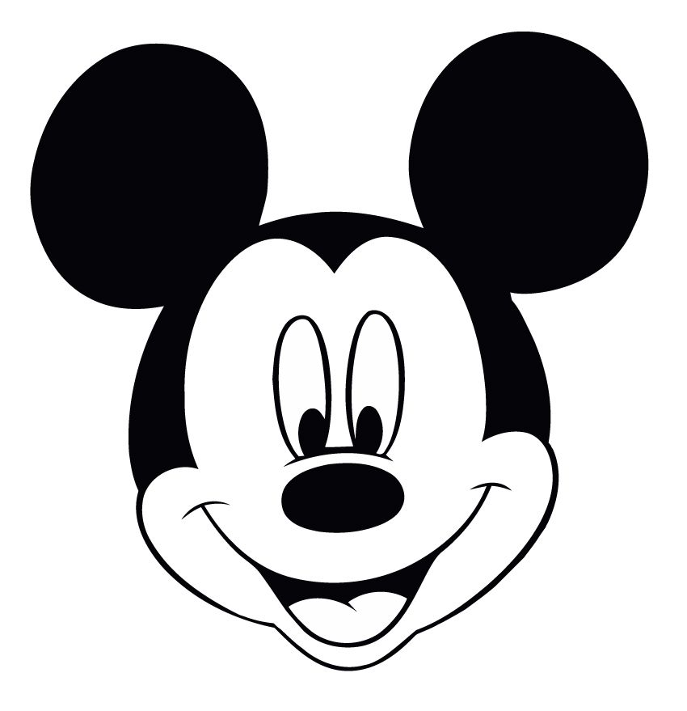
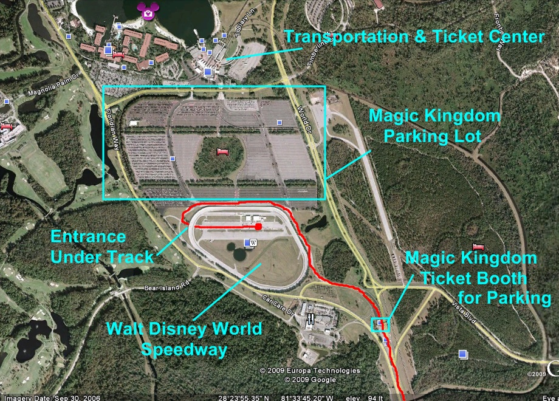
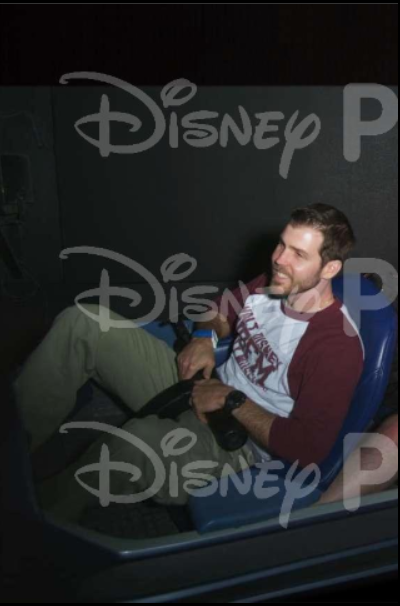
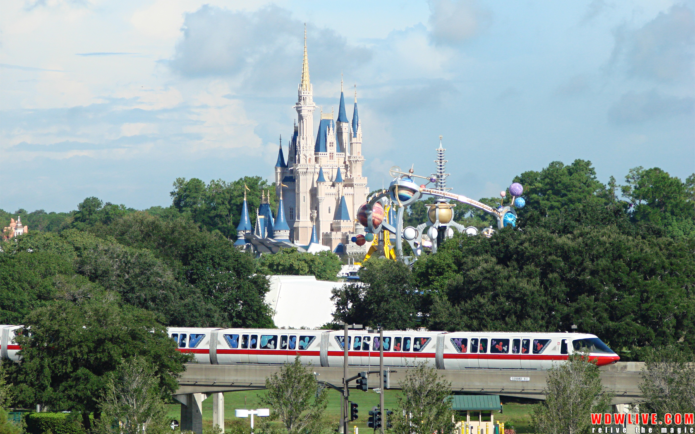
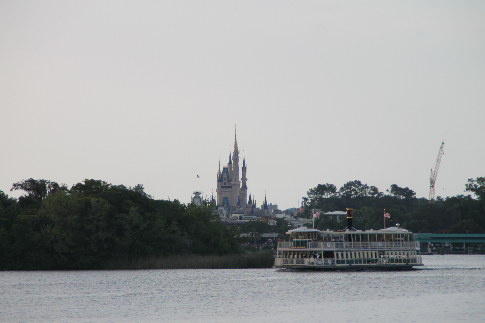
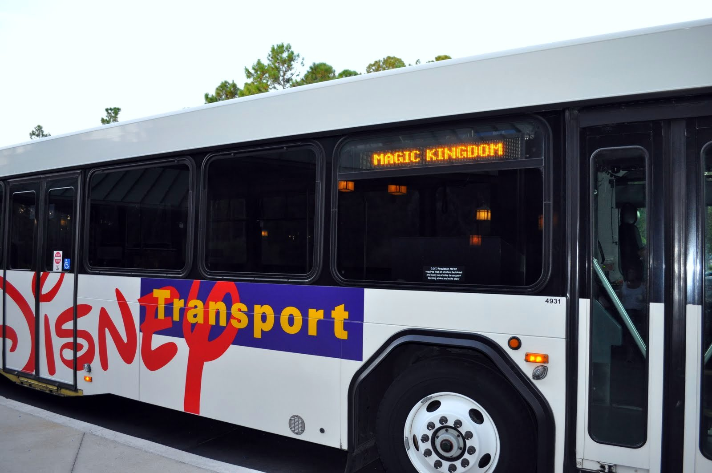
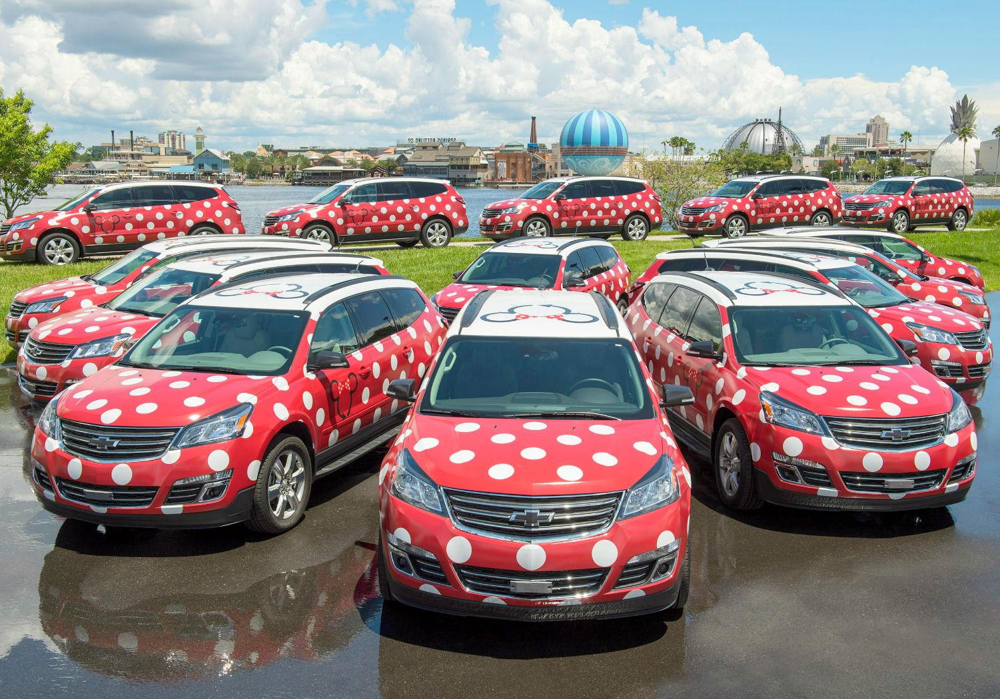
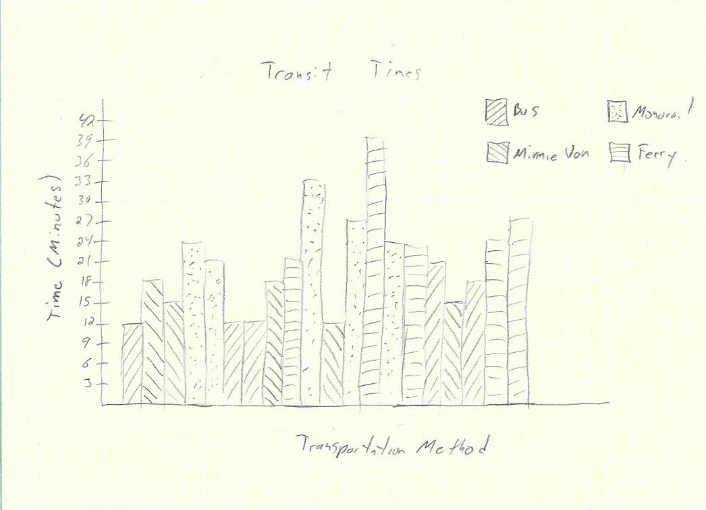
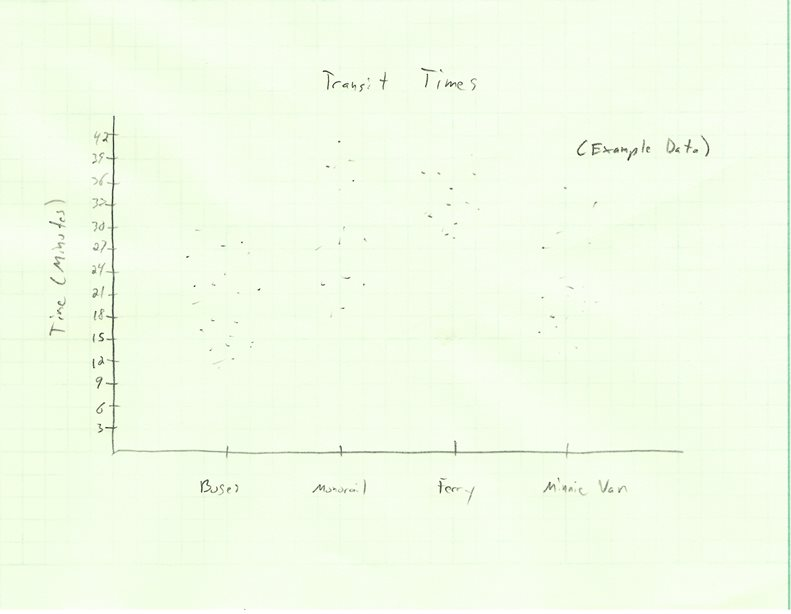
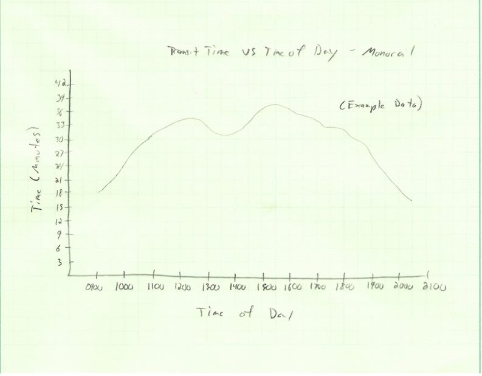

# IDS6145(SimTech 2018) - DISNEYWORLD "MAGIC KINGDOM" GUESTS ENTRANCE SYSTEM

# MouseHeadz

> * ADAM HARDNEY
> * BLAKE NGUYEN
> * MICHAEL STERKEL
> * RACHEL STRANEY
> * Project Title: MAGIC KINGDOM GUESTS ENTRANCE SYSTEM

## Project Roles
For our final project, we felt that it was in our best interest to assign specific roles and responsibilities to each of our team members. Based on our knowlege, skills and abilities, we wanted to really demonstrate each of our indivdual and collective strengths in our final project. Rachel and Michael have been our project's avid Anylogic model builders. They have been leading the efforts in creating the model of our system. Blake and Adam are responsible for the research and written report of the final project. Collectively, we have been successful at collaborating and supporting one another at various stages of our final project. We strongly believe that our team has performed well together and that our final project represents are efforts and successes.

## Abstract

Magic Kingdom, at Walt Disney World theme parks in Orlando Florida, has lived up to its tagline as being "The Most Magical Place on Earth" by becoming one of the most visited theme parks in the world. According to the Themed Entertainment Association Global Attractions Attendance report in 2015, Walt Disney's Magic Kingdom hosted over 20 million visitors. (http://www.teaconnect.org/images/files/TEA_160_611852_160525.pdf). Avid Disney goers and first time guests are well aware of the affects of population size and it's impact on the overall theme park experience. Not only does the population size affect overall experience for guests but it also imposes safety issues.
Compounding this issue is the bottlenecking created by the Transportation and Ticket Center (TTC), where guests must travel by ferry boat, monorail, bus, and Minnie van to get to the official main street entrance (park entrance) of Magic Kingdom. The goal of our system is to model the time it would take guests to arrive at the Magic Kingdom park entrance based on which mode of transportation taken from the TTC. We hypothesized that the two modes of transportation that utilize efficiency and safety are Disney's buses and Minnie Vans. From our results, our model depicts that the most efficient mode of transportation are the Disney's buses.

## General Introduction

Walt Disney theme parks are one of the most well-known theme parks in the world. Specifically, Magic Kingdom, which is located in Orlando, Florida is popularly known as the happiest place on earth. The popular title is a result of just how innovative Walt Disney is. Walt Disney built his first theme park, known as Disneyland in Anaheim, California.
Unfortunately, when he first built the Disneyland theme park, he ran out of property to continue to build on. Therefore, he sought out more property in Orlando, Florida where he then began to build the Disney World theme park.

While building the Magic Kingdom park, Walt Disney and his team of engineers discovered a problem. The area directly in front of Magic Kingdom was a swamp and would not be a suitable area to build a parking lot. They resolved this issue by building the guests' parking lot a mile and a half away from the Magic Kingdom entrance. The former swamp was rehabilitated into the Seven Seas Lagoon as part of a solution to fix the the parking lot issue. However, after rehabilitating the swamp into the Seven Seas lagoon Walt Disney needed some form of transporation from the parking lot, which is located a mile and half away from the Magic Kingdom entrance.

Walt Disney developed the Transportation and Ticket Center (TTC), where guests can buy their admission into the theme park and secure transportation into Magic Kingdom's park entrance. In the original concept of the TTC, guests would travel to and from Magic Kingdom by ferry boats across the Seven Seas Lagoon or use the "highway-in-the-sky" as known as the monorail station. Later on, Walt Disney built hotels that were not supported by the monorail transportation. Therefore, these hotels required the use of an alternative mode of transportation, and as a solution they implemented the use of bus transportation. As Walt Disney continued to build additional hotels around the theme park, the TTC became overly crowded with guests. The monorail and ferry boat transporation methods could not keep up with the demand and high volume of guests coming in and out of Magic Kingdom. Therefore, in order to alleivate the high volume of guests, they had to implement other methods of  transporation for their guest. Currently, the TTC offers four modes of transportation to and from Magic Kingdom (bus, monorail, ferry boat, and Minnie van). The image below depicts an areal view of the system we are proposing to simulate:

From our research, we found that Disney's Magic Kingdom theme park averages roughly 53,000 guests attendence per day. Of this, there are roughly 12,000 at most that can enter the park through the Magic Kingdom parking lot as this is the number of availabe parking spots. We can hypothesize that the high volume of guests that visit the Magic Kingdom park experience extensive wait times to travel to and from the TTC. Extensive wait times is a problem that is both interesting and relevant to Disney's Magic Kingdom park visitors, as it may affect the quality of  the overall experience while also imposing potential safety concerns. We propose the following system: Magic Kingdom Guests Entrance System as an attempt to improve upon the issue related to extensive wait times for the offered modes of transportation. We are interested in investigating and identifying: (1) which mode of transportation is the fastest method to get to the TTC to the park entrance of Magic Kingdom, (2) does the design of the TTC create bottlenecking, and (3) does it lead to unnecessary wait times that can lead to negative experiences for their guests.

We found very limited research on Walt Disney's modes of transportation in terms of which option is the fastest or how extensive wait times can affect visitors experience. What we did find in our research is which mode of transportation is the most used, which is the iconic monorail system. We also found limited research on whether or not the TTC creates bottlenecking during different volumes of time and whether or not that it leads to extensive wait times. We believe our project makes the following contributions to answering research questions that have yet to be identified or answered. We beleive the first contribution would benefit Disney's Magic Kingdom park visitors. As our research will investigate the fastest type(s) of transportation offered, if time of day affects which method is the fastest, if bottlenecking occurs and during what time of day does it occur. We believe our project may contribute to improving upon the issue with extensive wait times. Our project will also contribute to the overall limited research in this particular area. We also hope that our project contributes as initial efforts for future research in this specific area of research.

Crowd diversion systems have been an area of focus for the theme park industry for a number of years. Disney's FASTPASS and Universal Studios' Express Pass have both been developed and implemented to reduce the amount of lines and wait times once guests are inside the park. However, these solutions do very little to remedy the time it takes guests to enter the park. As this is the first thing guests experience during their visit to the Magic Kingdom, this is a very import piece to the broader park system. Past simulation research can be generalized to our project by substituting rides with the main queuing points of the Magic Kingdom entrance. This project makes the following contributions towards:
-	Identifying problems within Walt Disney's TTC.
-	Identifying the fastest type(s) of transportation offered at the TTC.
-	Identifying the slow type(s) of transportation offered at the TTC.
-	Investigating whether or not extensive wait times affect efficiency and safety.
-	Limitations of our research as well as propose future research directions in this area of research.

A member of our team enjoying Space Mountain at Walt Disney World.

## The Model

An Object Diagram is shown below, which summarizes the main objects of the Magic Kingdom Guest Entrance System. As guests arrive they can park in one of two lots, the Hero lot or the Villain lot. From there, guests travel by foot or by tram to the security checkpoint. Guests are asked to go through the security lines. Security lines are divided into guests with bags and guest without bags. Finally, from the Transportation and Ticket Center (TTC), guests have a choice which mode of  transportation (bus, monorail, ferry boat, or Minnie Van) to take to get to the entrance of the park.

Walt Disney Monorail transportation:

Walt Disney Ferry boat transportation:

Walt Disney Bus transportation:

Walt Disney Minnie Van transportation:

## Fundamental Questions
The Magic Kingdom Guest Entrance System is being designed for simulation to answer the following fundamental questions:

- Which transportation method (monorail, ferry boat, bus or Minnie van) is the fastest method to get from the Transportation and Ticket Center (TTC) to the park entrance of Magic Kingdom?

- Does the design of the Transportation and Ticket Center (TTC) create bottlenecking during high volume times that could lead to safety issues for the visitors?

- Does the design of the Transportation and Ticket Center (TTC) lead to unnecessary wait times that can lead to a negative visitor experience?

The sub questions that flow from the 3 fundamental questions are:

- How long does it take (in minutes) guests to travel to the Magic Kingdom entrance from the TTC via monorail, via ferry boat, via bus, and via Minnie Van?
- What is the capacity of the Ferry boat, Monorail, Bus and Minnie Van, respectively?
- How often do each of the four methods run?
- Are any of the transportation methods on a set schedule?
- Does travel time of the four methods vary depending on the time of day?
- What is the travel time at different times of the day?
- What are the hours of operation of the four transportation methods?
- Is there a cost associated with each of the transportation methods?
- If there was an emergency could park visitors exit the park in a safe and efficient manner?

## Expected Results

The fundamental questions are to be answered by the simulation created to represent the system.  However, before the simulation is built there are notions of what answers to some of the questions will be and the simulation will be used to determine if these pre stated answers are correct.

- The Disney buses and Minnie vans are expected to have the shortest travel times. The monorail is expected to have the second shortest travel time and the ferry boats are expected to have the slowest travel time.

- The time it takes to travel from the TTC to the Magic Kingdom park entrance, regardless of transportation method, is expected to increase during peak visiting hours during the day. This expectation is from personal experience at the parks during peak times and the perception that the time it took was statistically significantly longer. For example, getting into the park during normal business hours is expected to take longer than as the park is nearing closing time.

- The expectation, before running the simulation, is that a bottleneck is created at the TTC during peak hours due to its design.

For the Magic Kingdom Entrance system the data will be presented in the form of line graphs, scatter plots and histograms.

Histograms will be used to plot the time (in minutes) it takes to get into the park by the four different modes of transportation.

A scatter plot by groups will be used to track transit times (in minutes) of agents.  The scatter plot will visually show where most of the transit times fall. Visualizations like these can also be used to compare the duration of time to enter the park at peak and non-peak times of the day.

A line graph will be used to show the change in average transit time (in minutes) as the time of the day changes from the time the park opens until it closes. This can be useful when validating our model.

## Research Methods

## Methods used in Similar Studies
There have been numerous publications involving research to estimate visitors at theme parks and evaluate guest traffic flow. The purpose behind much of this research falls into one of two categories: 1. ) Assessment of how wait times impact park visitor experience and 2.) Analysis of emergency or disaster management relative to congestion in the park. For example, Reza H. Ahmadi focused on the Six Flags Magic Mountain theme park to address questions of daily operations such as managing traffic flow in the park and suggesting routing tours for guests (Ahmadi, 1997). Data used in his analysis included primary data from a visitor questionnaire and direct measures provided by the park which included park attendance and queue lengths at rides. More recent research by Shih-Fen Cheng, et al. in 2013 and Liou Chu, et al. in 2014 also considered guest satisfaction . Whereas  Shih-Fen Cheng and his team developed and constructed a very large agent-based model, Liou Chu approached their work by designing a Theme Park Queuing System using discrete-event simulation (Cheng, 2013; Chu, 2014). A publication by Gurkan Solmaz and Damla Turgut (2017), on the other hand, is a good example of how simulating theme park attendee traffic can address issues of safety. Their study focused on the foot traffic patterns of guests in theme parks to evaluate mobility in the event of a disaster. The researchers used information collected from mobile devices carried by 11 volunteers to simulate visitor movement around the park. The simulation used in the study was an agent-based model (Solmaz, 2017).

## Proposed Methods for our Research

Although there are several approaches to simulating traffic and movement throughout a theme park, our team has elected to develop a discrete-event simulation to address our research questions. Furthermore, we plan to include an agent-based aspect to our simulation since our preliminary research has concluded that characteristics of the park guests play a significant factor in our system. For example, guests visiting in large groups or with small children may take longer to reach the entrance of the park from the Transportation and Ticket Center (TTC). Therefore, agents in our model will be groups of individuals with attributes like average age and number in the group.

As described in the Model section, there are assumptions and parameters that need to be estimated to develop a meaningful simulation. The resources mentioned above and others will assist us in identifying these estimates. Below are a few of the preliminary estimates for the simulation as well as any relevant assumptions or limitations:
- The maximum daily park attendance (groups of guests) by way of the parking lot is 12,156 (https://www.wdwmagic.com/facts!.htm)

- The typical travel time required for each mode of transport into park (using Google maps distance measuring tool the distance of the bus route (and the Minnie van route) is approximately 1.12 miles, the distance of the Monorail route is approximately 1.56 miles and the distance of the ferry route is approximately .67 miles).

- The typical wait time through security at the Transportation and Ticket Center (TTC) will depend on whether the guests are carrying bags as there are two security lines - one for guests with bags and the other for guests without. For simplicity, if a group is carrying a bag, all members of that group will go through the same security line.

- Although any mechanical issues for the different modes of transportation (e.g. out of service buses, engine problems) will increase travel time for guests, our model assumes all modes of transportation are running continuously during Magic Kingdom's hours of operation. 

- All modes of transportation, excluding the Minnie vans, are included in the price of admission, while a ride in a Minnie van is a flat rate fee of $20 per ride. While this may be a factor in guests' choices for transportation, this information will not be considered in our model.

## Results
- variable assumptions
- 

## Discussion
- limitations of our simulation/study
- why we didn't use the minnie vans
- initial assumptions versus our actual results
- limitations of using anylogic

## Limitations
While we had the opprotunity to explore some aspects of Anylogic, we noticed that the free version has some restrictions to the features offered on Anylogic. For example, we wanted to run our simulation for longer than an hour but that requires us to purchase the full version of Anylogic. Since we were unable to run our simulation for longer than an hour, we feel that our results may vary due to this limitation. If given an opprotunity to work with the full version of Anylogic, we would like to further investigate whether or not running our simulation for more than an hour would alter our results. Future studies should consider purchasing the full version of Anylogic to further investigate this limitation in our study.

To make our simulation more realistic to the real world settings of Disney World, we ran into issues with trying to build the logic for the two trams (heroes and villians trams). 

https://forums.wdwmagic.com/threads/never-go-to-the-park-without-a-bag.935235/
(Possible reference for bag and no bag line)

## References

Ahmadi, R. H. (1997). Managing Capacity and Flow at Theme Parks. Operations Research. https://doi.org/10.1287/opre.45.1.1

Cheng, S., & Lin, L. (2013). An agent-based simulation approach to experience management in theme parks. In Winter Simulation Conference (pp. 1527–1538).

Gigliotti, A. R., Russell, A., & Gentry, R. J. (2016). It’s a Small World: Worldwide Declining Attendance and Disney Theme Parks. SAGE Business Cases Originals.

Richardson, S. (2014). 9 things you never knew about the Walt Disney world monorail system. https://www.themeparktourist.com/features/20141219/29760/10-things-you-never-knew-about-disney-world-monorail-system

Solmaz, G., & Turgut, D. (2017). Modeling pedestrian mobility in disaster areas. Pervasive and Mobile Computing, 40, 104–122. https://doi.org/10.1016/j.pmcj.2017.05.005

Spence, J. (2011). Transportation and ticket center - TTC. http://land.allears.net/blogs/jackspence/2011/04/transportation_and_ticket_cent.html

WDWMAGIC: An Unofficial Walt Disney World Fan Site. *Facts*. https://www.wdwmagic.com/facts!.html

## Image References
http://www.disneyeveryday.com/free-rides-at-the-richard-petty-driving-experience-in-walt-disney-world/

http://www.chipandco.com/monorail-happy-hour-adult-escape-87063/

https://www.undercovertourist.com/blog/rent-or-ride-car-rental-considerations-for-your-orlando-vacation/

https://itsofftoneverland.wordpress.com/tag/magic-kingdom/page/2/

https://www.tripsavvy.com/the-ultimate-guide-to-disney-world-transportation-4149857