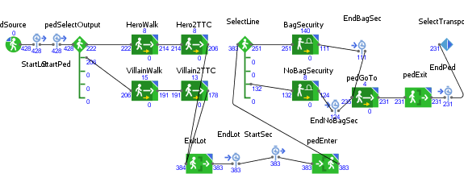
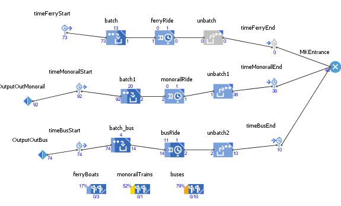
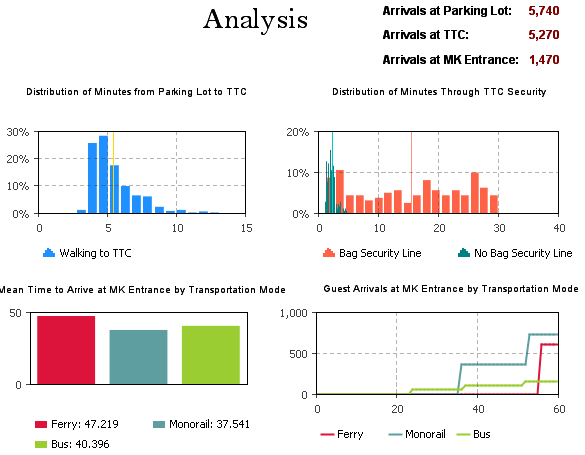

# IDS6145(SimTech 2018) - DISNEYWORLD "MAGIC KINGDOM" GUESTS ENTRANCE SYSTEM

# MouseHeadz

> * ADAM HARDNEY
> * BLAKE NGUYEN
> * MICHAEL STERKEL
> * RACHEL STRANEY
> * Project Title: MAGIC KINGDOM GUESTS ENTRANCE SYSTEM

## Project Roles
For our final project, we felt that it was in our best interest to assign specific roles and responsibilities to each of our team members. Based on our knowledge, skills and abilities, we wanted to demonstrate our individual and collective strengths in our final project. Rachel and Michael have been our project's avid Anylogic model builders. They have been leading the efforts in creating the model of our system as well as data analysis. Blake and Adam are responsible for the research and written report of the final project. Collectively, we have been successful at collaborating and supporting one another at various stages of our final project. We strongly believe that our team has performed well together and that our final project represents are efforts and successes.

## Project Video

## Presentation PowerPoint

## Abstract

Magic Kingdom, at Walt Disney World theme parks in Orlando Florida, has lived up to its tagline as being "The Most Magical Place on Earth" by becoming one of the most visited theme parks in the world. According to the Themed Entertainment Association Global Attractions Attendance report in 2015, Walt Disney's Magic Kingdom hosted over 20 million visitors. (http://www.teaconnect.org/images/files/TEA_160_611852_160525.pdf). Avid Disney goers and first time guests are well aware of the affects of population size and it's impact on the overall theme park experience. Not only does the population size affect overall experience for guests but it also imposes safety issues.
Compounding this issue is the bottlenecking created by the Transportation and Ticket Center (TTC), where guests must travel by ferry boat, monorail, bus, and Minnie van to get to the official main street entrance (park entrance) of Magic Kingdom. The goal of our system is to model using the Anylogic, the time it would take guests to arrive at the Magic Kingdom park entrance based on which mode of transportation taken from the TTC. We hypothesized that the two modes of transportation that utilize efficiency and safety are Disney's buses and Minnie Vans. From our results, our model depicts that the most efficient mode of transportation are the Disney's buses.

## General Introduction

Walt Disney theme parks are one of the most well-known theme parks in the world. Specifically, Magic Kingdom, which is located in Orlando, Florida is popularly known as the happiest place on earth. The popular title is a result of just how innovative Walt Disney is. Walt Disney built his first theme park, known as Disneyland in Anaheim, California.
Unfortunately, when he first built the Disneyland theme park, he ran out of property to continue to build on. Therefore, he sought out more property in Orlando, Florida where he then began to build the Disney World theme park.

While building the Magic Kingdom park, Walt Disney and his team of engineers discovered a problem. The area directly in front of Magic Kingdom was a swamp and would not be a suitable area to build a parking lot. They resolved this issue by building the guests' parking lot a mile and a half away from the Magic Kingdom entrance. The former swamp was rehabilitated into the Seven Seas Lagoon as part of a solution to fix the the parking lot issue. However, after rehabilitating the swamp into the Seven Seas lagoon Walt Disney needed some form of transportation from the parking lot, which is located a mile and half away from the Magic Kingdom entrance.

Walt Disney developed the Transportation and Ticket Center (TTC), where guests can buy their admission into the theme park and secure transportation into Magic Kingdom's park entrance. In the original concept of the TTC, guests would travel to and from Magic Kingdom by ferry boats across the Seven Seas Lagoon or use the "highway-in-the-sky" as known as the monorail station. Later on, Walt Disney built hotels that were not supported by the monorail transportation. Therefore, these hotels required the use of an alternative mode of transportation, and as a solution they implemented the use of bus transportation. As Walt Disney continued to build additional hotels around the theme park, the TTC became overly crowded with guests. The monorail and ferry boat transportation methods could not keep up with the demand and high volume of guests coming in and out of Magic Kingdom. Therefore, in order to alleviate the high volume of guests, they had to implement other methods of  transportation for their guest. Currently, the TTC offers four modes of transportation to and from Magic Kingdom (bus, monorail, ferry boat, and Minnie van). The image below depicts an areal view of the system we are proposing to simulate:

From our research, we found that Disney's Magic Kingdom theme park averages roughly 53,000 guests attendance per day. Of this, there are roughly 12,000 at most that can enter the park through the Magic Kingdom parking lot as this is the number of available parking spots. We can hypothesize that the high volume of guests that visit the Magic Kingdom park experience extensive wait times to travel to and from the TTC. Extensive wait times is a problem that is both interesting and relevant to Disney's Magic Kingdom park visitors, as it may affect the quality of  the overall experience while also imposing potential safety concerns. We propose the following model: Magic Kingdom Guests Entrance System as an attempt to improve upon the issue related to extensive wait times for the offered modes of transportation. We are interested in investigating and identifying: (1) which mode of transportation is the fastest method to get to the TTC to the park entrance of Magic Kingdom, (2) does the design of the TTC create bottlenecking, and (3) does it lead to unnecessary wait times that can lead to negative experiences for their guests.

We found very limited research on Walt Disney's modes of transportation in terms of which option is the fastest or how extensive wait times can affect visitors experience. What we did find in our research is which mode of transportation is the most used, which is the iconic monorail system. We also found limited research on whether or not the TTC creates bottlenecking during different volumes of time and whether or not that it leads to extensive wait times. We believe our project makes the following contributions to answering research questions that have yet to be identified or answered. We believe the first contribution would benefit Disney's Magic Kingdom park visitors. As our research will investigate the fastest type(s) of transportation offered and if bottlenecking occurs. We believe our project may contribute to improving upon the issue with extensive wait times. Our project will also contribute to the overall limited research in this particular area. We also hope that our project contributes as initial efforts for future research in this specific area of research.

Crowd diversion systems have been an area of focus for the theme park industry for a number of years. Disney's FASTPASS and Universal Studios' Express Pass have both been developed and implemented to reduce the amount of lines and wait times once guests are inside the park. However, these solutions do very little to remedy the time it takes guests to enter the park. As this is the first thing guests experience during their visit to the Magic Kingdom, this is a very import piece to the broader park system. Past simulation research can be generalized to our project by substituting rides with the main queuing points of the Magic Kingdom entrance. This project makes the following contributions towards:
-	Identifying problems within Walt Disney's TTC.
-	Identifying the fastest type(s) of transportation offered at the TTC.
-	Identifying the slow type(s) of transportation offered at the TTC.
-	Investigating whether or not extensive wait times affect efficiency and safety.
-	Limitations of our research as well as propose future research directions in this area of research.

Michael Sterkel, a member of our team enjoying Space Mountain at Walt Disney World.

Adam Hardney, a member of our team enjoying Magic Kingdom with his family.

Blake Nguyen, a member of our team enjoying Space Mountain at Disneyland.

## The Model

An Object Diagram shown below depicts the main objects of the Magic Kingdom Guest Entrance System. As guests arrive they are directed to park in one of the two parking lots, the Hero lot or the Villain lot. From the parking lot, guests travel by foot or by tram to the security checkpoint. Security lines are divided into guests with bags and guest without bags. Finally, from the Transportation and Ticket Center (TTC), guests have a choice which mode of  transportation (bus, monorail, ferry boat, or Minnie Van) to take to get to the entrance of the park.

### Modes of Transportation:
Walt Disney Monorail

Walt Disney Ferry boats

Walt Disney Buses

Walt Disney Minnie Vans

## Fundamental Questions
The Magic Kingdom Guest Entrance System is being designed for simulation to answer the following fundamental questions:

- Which transportation method (monorail, ferry boat, bus or Minnie van) is the fastest method to get from the Transportation and Ticket Center (TTC) to the park entrance of Magic Kingdom?

- Does the design of the Transportation and Ticket Center (TTC) create bottlenecking during high volume times that could lead to safety issues for the visitors?

- Does the design of the Transportation and Ticket Center (TTC) lead to unnecessary wait times that can lead to a negative visitor experience?

The sub questions that flow from the 3 fundamental questions are:

- How long does it take (in minutes) guests to travel to the Magic Kingdom entrance from the TTC via monorail, via ferry boat, via bus, and via Minnie Van?
- What is the capacity of the Ferry boat, Monorail, Bus and Minnie Van, respectively?
- How often do each of the four methods run?
- Are any of the transportation methods on a set schedule?
- Does travel time of the four methods vary depending on the time of day?
- What is the travel time at different times of the day?
- What are the hours of operation of the four transportation methods?
- Is there a cost associated with each of the transportation methods?
- If there was an emergency could park visitors exit the park in a safe and efficient manner?

## Expected Results

The fundamental questions are to be answered with the data collected from the model of our system. To some degree we have preliminary results that are supported by the notions of existing research. However, to fully address our fundamental questions a model is needed to better address the questions related to our system.

- The Disney buses and Minnie vans are expected to have the fastest travel times. The monorail is expected to have the second fastest travel time and the ferry boats are expected to have the slowest travel time.

- The time it takes to travel from the TTC to the Magic Kingdom park entrance, regardless of transportation method, is expected to increase during peak visiting hours during the day. This expectation is interfered by personal experiences of our researchers. The parks during peak times and the perception that the time it took was statistically significantly longer. For example, getting into the park during normal business hours is expected to take longer than as the park is nearing closing time.

- The expectation, before running the simulation, is that a bottleneck is created at the TTC during peak hours due to its design.

### Visualized Data of Expected Results:
For the Magic Kingdom Entrance system the data will be presented in the form of line graphs, scatter plots, and histograms.

_Line Graph_. A line graph will be used to show the change in average transit time (in minutes) as the time of the day changes from the time the park opens until it closes. This can be useful when validating our model.

_Scatter Plot_. A scatter plot by groups will be used to track transit times (in minutes) of agents. The scatter plot will visually show where most of the transit times fall. Visualizations like scatter plots can also be used to compare the duration of time it takes to enter the park at peak and non-peak times throughout the day.

_Histogram_. Histograms will be used to plot the time (in minutes) it takes to get into the park by the four different modes of transportation (monorail, ferry, bus and Minnie van).

## Research Methods

### Methods used in Similar Studies:
There is existing research related to investigating the estimate of visitor attendance at theme park and evaluations of the visitor traffic flow. The purpose behind this research falls into one of the two categories: 1) assessment of how wait times impact theme park visitor experience and 2) analysis of emergency or disaster management relative to congestion in the park. For example, Ahmadi (1997) focused on the Six Flags Magic Mountain theme park to address questions related to daily operations such as managing traffic flow in the park and suggestions for rerouting of tours offered to guests. Data used in his formal analysis included primary data collected from  visitor questionnaires and direct measures provided by the park, which included park attendance and queue lengths at ride attractions.

More recent research by Shih-Fen Cheng et al. (2013) and Liou Chu et al. (2015), considered guest satisfaction. Whereas  Shih-Fen Cheng et al. (2013) developed and constructed a very large agent-based model. Liou Chu et al. (2014) approached their work by designing a Theme Park Queuing System using discrete-event based simulation (Cheng, 2013; Chu, 2014). A publication by Gurkan Solmaz and Damla Turgut (2017), on the other hand, is a good example of how simulating theme park attendance traffic can address issues of safety. Their study focused on the foot traffic patterns of guests in theme parks to evaluate the degree of mobility in the event of a disaster. The researchers used information collected from mobile devices carried by 11 volunteers to simulate visitor movement around the park. The simulation used in the study was an agent-based model (Solmaz, 2017).

### Proposed Methods for Our Research:
Although there are several approaches to simulating traffic and movement throughout a theme park, our team has elected to develop a discrete-event based simulation to address our research questions. Furthermore, we plan to include an agent-based aspect to our simulation since our preliminary research has concluded that characteristics of the park guests play a significant factor in our system. For example, guests visiting in large groups or with small children may require more time to reach the entrance of the park from the Transportation and Ticket Center (TTC). Therefore, agents in our model will be groups of individuals with attributes like average age and number in the group.

As described in the Model section of our report, there are assumptions and parameters that need to be estimated to develop a meaningful simulation. The resources mentioned will assist us in identifying these estimates. Below are a few of the preliminary estimates for the simulation as well as any relevant assumptions or limitations:
- The maximum daily park attendance (groups of guests) by way of the parking lot is 12,156 (https://www.wdwmagic.com/facts!.htm)

- The typical travel time required for each mode of transportation into the park using Google maps distance measuring tool reports that the distance of the bus route and the Minnie van routes are approximately 1.12 miles, the distance of the Monorail route is approximately 1.56 miles and the distance of the ferry route is approximately .67 miles).

- The typical wait time through the security checkpoint before arriving at the Transportation and Ticket Center (TTC) will depend on whether or not guests are carrying bags into the park. There is essential two forms of lines at the security checkpoint; guest with bags and guest with no bags. For simplicity, guests with bags, will go through the same security line.

- Although all modes of transportation may experience mechanical issues (e.g., out of service buses, engine problems, system malfunctions, etc.). We excluded this issue to obtain some control in our model. Therefore, we will be assuming that all modes of transportation are running without any mechanical issues during the duration of our model.

- All modes of transportation, excluding the Minnie vans, are complimentary and included in the price of admission with the exception of the Minnie vans. There is a flat rate fee of $20.00 per ride that is associated with the Minnie van transportation option. The cost factor associated with the Minnie vans may affect the guests' choice of which mode of transportation to take. Therefore, this particular mode of transportation will not be implemented in our model.

### Final Methods Used in Our AnyLogic Model:
The model was built in AnyLogic into two parts: a Pedestrian portion and a Transit portion. The Pedestrian portion included the parking lot and the security lines at the TTC. The Transit portion included the three modes of transportation (ferry, monorail, bus) from the TTC to the MK entrance. The information that we collected was difficult to obtain due to the proprietary nature of the Walt Disney World operations. Therefore, some of our estimates were drawn from the image of the transportation map of the Magic Kingdom theme park as well as other sources. A few examples of our sources are shown below.

_Transportation map of Magic Kingdom_. This map was used to identify how many transit types run. We concluded that one monorail, three ferries, and ten buses would be implemented in our model.

_Mapwalk_. This was used to evaluate how long it would take guests to walk from the parking lot to the Ticket and Transportation Center (TTC). We used this information to validate this portion of our model.

_Nova bus_. Research indicated that the bus fleet NOVA bus used by the Walt Disney company. We used this information to identify the capacity of each of the Disney buses.

### Table of Final Methods Used in Our AnyLogic Model:
<table>
<tr><th>Parameter</th><th>Real System Estimate</th><th>Scaled Estimate for AnyLogic (if applicable)</th><th>Methods</th></tr><tbody>
 <tr><td>Rate at which guests begin walking through the Magic Kingdom Parking Lot</td><td>100 guests/min</td><td>10 guests/min</td><td>Our research shows that the parking lot holds at most 12,156 cars. Based on anecdotal evidence, we assumed the lot would be half full after one hour as quests typically visit for an entire day. This seems to be a very conservative estimate. This rate is scaled down to 10% to account for the large computing power required to run this model. </td></tr>
 <tr><td>Proportion of guests that enter from the Heroes lot as opposed to the Villains lot</td><td>0.5</td><td>-</td><td>As guests typically line up at the parking gates prior to the park opening and parking attendants direct cars quickly and efficiently, we assumed the lots would be filled equally.</td></tr>
 <tr><td>Speed of pedestrians walking</td><td>triangular(1,3,4) miles/hour</td><td>-</td><td>We researched how quickly people tend to walk at a comfortable speed. One of our sources estimated time and distance to walk by location (which the MK parking lot to TTC route was used).</td></tr>
 <tr><td>Number of security lines available</td><td>20</td><td>2</td><td>As we decided to restrict  our simulation to the first hour the park is open, we estimate the real world number of lines would be close to 20. We scaled the number of lines to 10% to align with the number of guests.  </td></tr>
 <tr><td>Likelihood of guest bringing a bag to park</td><td>0.65</td><td>-</td><td>Again, due to certain information required for this model being very proprietary and difficult to obtain, we used our experience to estimate for this. As the average age of guests tend to be young children, we assumed their accompanying adults would be carrying bags.</td></tr>
 <tr><td>Delay time for security lines with bags</td><td>triangular(0.08, 0.25, 0.5)</td><td>-</td><td>Estimates for each delay type were obtained by reenacting the event multiple times with group members and tracking time in seconds. We assume that guests without bags would stay together with members of their group and at times go through the bag security line. Additionally, it has been observed that guests without bags have carried strollers through which although is not considered a bag can take some time to check in the No bag lines. We wanted to keep the model units of time consistent, so time was converted from seconds to minutes.</td></tr>
 <tr><td>Delay time for security lines without bags</td><td>triangular(0.05, 0.16, 0.33)</td><td>-</td><td>&nbsp;</td></tr>
 <tr><td>Likelihood of guests selecting a mode of transport to the MK entrance</td><td>Ferry (1/3); Monorail (1/3);    Bus (1/3)</td><td>-</td><td>We were uncertain of this parameter and so we wanted to first test the model assuming that each mode is equally likely. We later ran the model with estimates of Ferry (0.3), Monorail (0.5) and bus (0.2), which we felt was more representative of guest behavior, to see how this impacted guest arrival times.</td></tr>
 <tr><td>Ferry capacity and resources</td><td>3 ferries; 600 guests each</td><td>3 ferries; 60 guests each</td><td>When the park first opens, there are 3 ferries that run between the TTC and the MK entrance. Each ferry can hold up to 600 guests. These numbers were obtained through public websites and blogs.</td></tr>
 <tr><td>Monorail capacity and resources</td><td>1 monorail; 360 guests</td><td>1 monorail; 36 guests</td><td>There is only one monorail line that runs between the TTC and the MK entrance. This monorail can hold up to 360 guests. These numbers were obtained through public websites and blogs.</td></tr>
 <tr><td>Bus capacity and resources</td><td>10 buses; 53 guests</td><td>10 buses; 5 guests</td><td>Although Disney owns and operates roughly 350 buses for all 4 parks and Disney Springs, it was difficult to obtain an estimate for how many of them are reserved for transportation between TTC and the MK entrance. Based on observation, it is likely that no more than 10 buses would be running at a given time for transport. Each bus can hold up to 53 guests. These numbers were obtained through public websites and blogs.</td></tr>
 <tr><td>Travel time for each  transportation mode</td><td>Ferry - 29 mph; Monorail - 40 mph; Bus - 40 mph</td><td>-</td><td>Research on road speed limits as well as information on average speeds of ferries and monorails were used.</td></tr>
</tbody></table>

### Model Description:
In this section, we wanted to further elaborate the different features we implemented in our Anylogic model.

#### Pedestrian model:
The pedestrian model used pedestrian flow tools in Anylogic. Pedestrians entered at a rate of 10 per minute. This rate was scaled down due to the high computation required to run the simulation (real world estimates were 100 guests per minute). A pedestrian select output was to direct guests from either the Hero lot or the Villian lot. Guests walked the length of the parking lot, then entered the TTC. As mentioned in our final methods table, sixty-five percent of guests go through the bag security line. While the remaining percent proceed through the no bag security line. Once guests pass through the security checkpoint they are to proceed to one of the modes of transportation. We have included a screenshot of our pedestrian logic that depicts the flow of guests on foot.

_Pedestrain logic_. This is a screenshot of the pedestrain logic in Anylogic.

#### Transit logic:
We intially assumed that guests would choose a means of transportation equally. A batch and unbatch tool was used in Anylogic to group guests together to move them to the Magic Kingdom entrance. The ferry maximum capacity was 600 guests, the monorail maximum capacity was 360 and the bus maximum capacity was 53. These were the real world estimates that were later scaled down due to the issue we had with running a large model. We decided to scale them to (60, 36, and 5) respectively. The travel time for the modes of transporation was also assumed to be equally distributed. The travel time in minutes for all three modes of transportation was assumed to be triangular (13, 15, and 18). The resource pool was used in conjunction with the service to set the number of vehicles that can be used at one time. The resource pool size for the ferry was set to 3, the resource pool size for the monorail was set to 10, and the resource pool size for the buses was set to 10.

_Transit logic_. This is a screenshot of the transit logic in Anylogic.

## Results
_Pedestrian model_. 

_Transit model_. 

## Discussion
Initally, we hypothesized that the two modes of transportation that were the most efficient and safest for theme park vistors were Disney's monorails and buses. However, based on our results we have concluded that the most efficient and safest mode of transportation is the Disney buses.
- why we didn't use the Minnie vans
- initial assumptions versus our actual results
- example of that is pedestrians only walk through the parking lot.

### Limitations:

_Anylogic_. While we had the opportunity to explore some aspects of Anylogic, we noticed that the personal learning edition (student free version) has some restrictions to the pedestrian features offered. For example, we wanted to run our simulation for longer than an hour but that required us to purchase the full version of Anylogic. Since we were unable to run our simulation for longer than an hour, we feel that our results may vary due to this single limitation. Initially, we wanted to implement a full scale of at least 6,000 vistors per hour but our computer systems could not withstand the large scale of vistors in our model. Therefore, in order to combat this issue, we had to scale the number of vistors down to ten percent. Originally, we wanted to include 6,000 vistors but unfortunately, we had to downsize to 600 people so that the model could fully function. This is a solution we came up with to remedy the limited computing power we experienced.

- tram is missing and why we couldn't implement the tram into our model on Anylogic.
- acknowledge how we developed a model of our system that could not fully implement all the aspects of the Disney transporation system.

_Data_. For our model, we found it difficult to implement real data within our model. This is due to the fact that Disney does not provide public data sets. As stated earlier in our written report, the Walt Disney company operates in a proprietery nature. Due to the company's proprietery nature, we found limited to no real data sets for our model. As a result we could not implement real data sets from Disney World. Therefore, we had to implement synthetic data to meet specific needs in the Anylogic features. In our research, we found that the Walt Disney company discloses their real data sets for the protection, privacy, and confidentiality of their guests. Thus, we had to use synthetic data in our model on Anylogic.

_Model resolution and model fidelity_. For our model, we identified limitiations in regards to model resolution and model fidelity. In our Modeling and Simultion course, we learned that model resolution refers to detail and precision of real world aspects in a model or simulation. We felt that we had limited model resolution becasue we ran into issues with implementing ...

We also identified limitations regarding model fidelity. Model fidelity refers to the accuracy of the representation when compared to the real world. We believe that our model provides some degree of accuracy when it comes to comparing our model to the real world. However, there were aspects of the Disney World Magic Kingdom transportation system that we did not implement in our model. For example, we did not implement the logic for the trams that operate from the guest parking lots (Hero and Villian lot) to the TTC. This was not implemented due to the complexity of our model's logic. We could not get the logic for the tram piece to work in conjuction with transit logic we have running. Therefore, we believe that we have limited model fidelity in our model.

### Future Research:
_Future Research for Anylogic_. If given an opportunity to work with the full version of Anylogic, we would like to further investigate whether or not running our simulation for more than an hour would alter our results. Future studies should consider working with the full version of Anylogic to further investigate this limitation in our study.

_Future Research for Data_.

_Future Research for Model resolution and model fidelity_.

Kider's email including the paper he wanted us to look over.

## References
Ahmadi, R. H. (1997). Managing Capacity and Flow at Theme Parks. Operations Research. https://doi.org/10.1287/opre.45.1.1

Cheng, S., & Lin, L. (2013). An agent-based simulation approach to experience management in theme parks. In Winter Simulation Conference (pp. 1527–1538).

Gigliotti, A. R., Russell, A., & Gentry, R. J. (2016). It’s a Small World: Worldwide Declining Attendance and Disney Theme Parks. SAGE Business Cases Originals.

Richardson, S. (2014). 9 things you never knew about the Walt Disney world monorail system. https://www.themeparktourist.com/features/20141219/29760/10-things-you-never-knew-about-disney-world-monorail-system

Solmaz, G., & Turgut, D. (2017). Modeling pedestrian mobility in disaster areas. Pervasive and Mobile Computing, 40, 104–122. https://doi.org/10.1016/j.pmcj.2017.05.005

Spence, J. (2011). Transportation and ticket center - TTC. http://land.allears.net/blogs/jackspence/2011/04/transportation_and_ticket_cent.html

WDWMAGIC: An Unofficial Walt Disney World Fan Site. *Facts*. https://www.wdwmagic.com/facts!.html

https://forums.wdwmagic.com/threads/never-go-to-the-park-without-a-bag.935235/

https://www.mapwalk.com/#/h/route

http://www.madisonareampo.org/planning/documents/BusSizeStudyFinalReportFebruary2014.pdf

## Image References
http://www.disneyeveryday.com/free-rides-at-the-richard-petty-driving-experience-in-walt-disney-world/

http://www.chipandco.com/monorail-happy-hour-adult-escape-87063/

https://www.undercovertourist.com/blog/rent-or-ride-car-rental-considerations-for-your-orlando-vacation/

https://itsofftoneverland.wordpress.com/tag/magic-kingdom/page/2/

https://www.tripsavvy.com/the-ultimate-guide-to-disney-world-transportation-4149857

http://www.wdwfocus.com/img/map/wdw-transport-map-full.png
