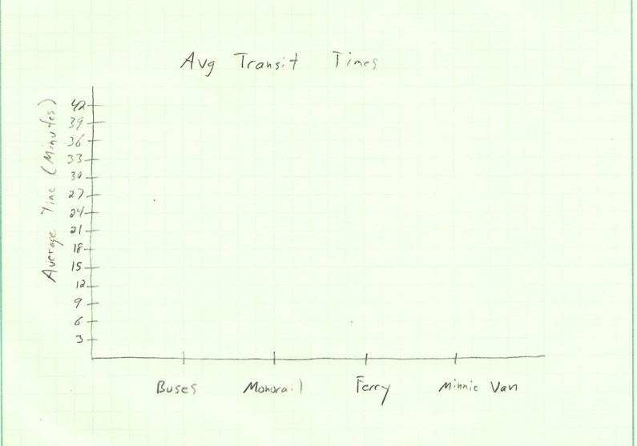

# IDS6145(SimTech 2018) - DISNEYWORLD "MAGIC KINGDOM" GUESTS ENTRANCE SYSTEM

# MouseHeadz

> * ADAM HARDNEY
> * BLAKE NGUYEN
> * MICHAEL STERKEL
> * RACHEL STRANEY
> * Project Title: MAGIC KINGDOM GUESTS ENTRANCE SYSTEM

# Abstract
Magic Kingdom, at Walt Disney World theme parks in Orlando Florida, has lived up to its tagline as being "The most Magical Place on Earth" by becoming one of the most visited theme parks in the world. According to the Themed Entertainment Association Global Attractions Attendance Report in 2015, Walt Disney's Magic Kingdom hosted over 20 million vistors. (http://www.teaconnect.org/images/files/TEA_160_611852_160525.pdf). For anyone who has the visited the Magic Kingdom theme park, the size of the crowds can affect guests' overall experience and impose safety issues. Compounding this issue is the bottleneck created by the Transportation and Ticket Center (TTC) where guests must travel by ferry boat, monorail, bus, and Minnie van to get to the official main street entrance (park entrance) to Magic Kingdom. The goal of our system is to model the time it would take guests to arrive at Magic Kingdom based on which mode of transportation taken from the TTC. We believe the two types of transportation that utilize efficency and safety are Disney's buses and Minnie vans.

(directions, - remove)
* (this Readme should "evolve" over time as you add and edit it)
* (once you are happy with it - copy it into the proposal directory, and remove the obvious sections that should be removed - Future work, etc)

## General Introduction

Walt Disney theme parks are one of the most well-known amusement parks in the world. Specifically, Magic Kingdom, which is located in Orlando, Florida is popularly known as the most happiest place on earth. The popular title is due to the innovation of Walt Disney himself. Walt Disney built his first theme park in Anaheim, California, known as Disneyland. Unfortunately, when he first builtn the Disneyland theme park, he ran out of property to build on. Therefore, he sought out more property in Orlando, Florida. He then began to build Disney World theme park in Orlando, Florida. While building Magic Kingdom park, Walt Disney and his team discovered a problem. The area directly in front of Magic Kingdom was a swamp and would not be suitable area to build a parking lot. They resolved this problem by building the guests parking lot a mile and a half away from Magic Kingdom. The former swamp was rehabilitaetd into the Seven Seas Lagoon as part of the the parking lot issue. However, Walt Disney faced another issue after combating the swamp problem. As a result of having to build the parking lot a mile and half away from Magic Kingdom, the need for transportation was discovered.

Walt Disney developed the Transportation and Ticket Center (TTC), where guests can buy their admission and secure transportation into Magic Kingdom's park entrance. In the original concept of the TTC, guests would travel to and from Magic Kingdom by ferry boats across the Seven Seas Lagoon or monorail "highway-in-the-sky". Later, Walt Disney built non-monorail hotels on Disney property, which required the use of bus transportation. As Walt Disney continued to build more hotels around the theme park, there became an overload at the TTC. The monorail and ferry boats could not keep up with the demand and high volume of guests coming in and out of Magic Kingdom. To help this, they developed an elaborate bus stop at Magic Kingdom. Currently, the TTC offers four modes of transportation to and from Magic Kingdom (bus, monorail, ferry boat, and Minnie van).

From our initial research, we found that Disney's Magic Kingdom averages about 53,000 guests per day. We can hypothesize that the high volume of guests that visit the Magic Kingdom park experience extensive wait times to travel to and from the TTC. Extensive wait times is a problem that is both interesting and relevant to Disney's Magic Kingdom park vistors, as it may affect the quality of guests experience while also imposing potential safety concerns. We propose the following system: Magic Kingdom Guests Entrance System as an attempt to resolve the problem of extensive wait times for the offered modes of transportation. We are interested in investigating and identifying answers to the following questions: which mode of transportation is the fastest method to get to and from the TTC to the park entrance of Magic Kingdom, does the design of the TTC create bottlenecking during high and low volume times, and does it lead to unnecessary wait times that can lead to negative visitor experiences.

We found limited to no research on Disney's mode of transportation in terms of which option is the fastest or how extensive wait times can affect vistors experience. We also found limited research on whether or not the TTC creates bottlenecking during different volumes of time and whether or not that it leads to extensive wait times. We believe our project makes the following contributions to answering research questions that have yet to be identified or answered. The first contribution, we believe would benefit Disney's Magic Kingdom park vistors. As our research will investigate the fastest type(s) of transportation offered, if bottlenecking occurs and during what time of day does it occurs. Our project's contributions will help Disney's employees as well as their guests in terms of how to approach extensive wait times. Our project will also contribute to the overall limited research in this particular area. We hope that our project's contributions become the starting point for future research as well.

This project makes the following contributions:
•	Identify problems within Walt Disney's TTC.
•	Identify whether or not extensive wait times affect vistors overall satisfactory experience.
•	Identify the fastest type(s) of transportation offered at the TTC.
•	Identify the slow type(s) of transportation offered at the TTC.
•	Investigate whether or not extensive wait times affect efficency and safety.
•	To the limitations of our research as well as propose future research directions in this area of research.

## The Model

(Provide structural and behavior diagrams of the system you wish to study.) (Why is your model a good abtraction of the problem you want to study?) (Are you capturing all the relevant aspects of the problem?) (Use the model to tell us what is going on.)

(explicitly list your requirements of what the model will have and simulate for the proposal)

## Fundamental Questions
The described system, entering Magic Kingdom, is being designed for simulation to answer fundamental questions that will ultimatley lead to the answers the system was built to find.  For this system, which involves transportation methods to and from Magic Kingdom, the following questions apply.

The overarching fundamental questions are:

- Which transportation method (Monorail, ferry boat, bus or Minnie van) is the fastest method to get from the Transportation and Ticket Center to the park entrance of Magic Kingdom?
	
- Does the design of the Transportation and Ticket Center (TTC) create a bottleneck during high volume times that could lead to safety issues for the visitors?
	
- Does the design of the Transportation and Ticket Center (TTC) lead to unnecessary wait times that can lead to a negative visitor experience?
		
The sub questions that flow from the 3 funamental questions are:
		
- What is the time, in minutes, that it takes to get to the Magic Kingdom Entrance from the TTC via the Ferry boat, via the Monorail, via the Buses and via the Minnie vans?
- What is the capacity of the Ferry boat, Monorail, Bus and Minnie Van, respectively?
- How often do each of the four methods run?
- Are any of the transportation methods on a set schedule?
- Does travel time of the four methods vary depending on the time of day?
- What is the travel time at different times of the day?
- What are the hours of operation of the four transportation methods?
- Is there a cost associated with each of the transportation methods?
- If there was an emergency could park visitors exit the park in a safe and efficient manner?
 

	
(At the end of the project you want to find the answer to these questions) (Formulate a few, clear questions. Articulate them in sub-questions, from the more general to the more specific. )

(From Mike) I'll have my section completed on 23 Feb, hopefully not too late in the day either.

## Expected Results

The fundamental questions are to be answered by the simulation created to represent the system.  However, before the simulation is built there are notions of what answers to some of the questions will be and the simulation will be used to determine if these pre stated answers are correct.

Disney buses and Minnie vans are expected to have the shortest travel times, the monorail as the second shortest travel time and the ferry boats as the slowest travel time. Using google maps distance measuring tool the distance of the bus route (and the Minnie van route) is approximately 1.12 miles, the distance of the Monorail route is approximately 1.56 miles and the distance of the ferry route is approximately .67 miles.

For this system, the time it takes to travel from the TTC to the Magic Kingdom park entrance, regardless of transportation method, is expected to increase during peak visiting hours during the day. This expectation is from personal experience at the parks during peak times and the perception that the time it took was statistically significantly longer.  This also applies to the direction of travel. Getting into the park during normal business hours is expected to take longer than exiting the park and conversely as the park is nearing closing time, the time to get into the park will decrease while the time to get out of the park will increase.

All modes of transportation are expected to run during the entire time the park is open except when a mode is not operating due to a mechanical issue that may arise.

The expectation, before running the simulation, is that a bottleneck is created at the TTC during peak hours due to its design.

All modes of transportation, excluding the Minnie vans, are included in the price of admission, while a ride in a Minnie van is a flat rate fee of $20 per ride.

For the presented system the data will be presented in the form of line graphs, scatter plots and histograms.

**(Mike Comment) In the directions for this section is said to hand draw some graphs, which I have given below, but it said something about not showing data but I wasn't sure, so I have graphs with Example Data and those without.  I can always remake these on the computer if you think its needed.  Please use whichever one you think would be best.

A histogram will be used to plot the average time (in minutes) it takes to get into the park by the four different modes of transportation.

A scatter plot will be used to track transit times (in minutes) of individual agents.  The scatter plot will visually show where most of the transit times fall.

A line graph will be used to show the change in transit time (in minutes) as the time of the day changes from the time the park opens until it closes.

(What are the answers to the above questions that you expect to find before starting your research?) (This changes from Expected (Proposal) to just Results (final report)) (you should verbally define them) (sketch a few graphs of what you are roughly going for - not the data but histogram of this, line graph of that, screen shot of an agent - use paper and pencil sketches)

So I'm not sure if this is correct.  The paragraph above says screen shot of an agent, though i'm not sure what it means by that.  Does it mean an agent in Anylogic or what an agent would be, which in our case are visitors to Disney.
**RS - I think we only need to describe an agent if we plan to use agent-based modeling.
QUESTIONS TO YOU ALL: which mode of transport will be the fastest - bus, rail or ferry? And why?
** 
**MS I think I answered the fastest question, in my update, I'm not sure where else to get info other than what I put int.

## Research Methods
(Cellular Automata, Agent-Based Model, Discrete Event Continuous Modeling...)(Python or Anylogic) (If you are not sure here: 1. Consult your colleagues, 2. ask the teachers, 3. remember that you can change it afterwards) (Steps in the process)

- Past research has been conducted to estimate visitors at amusement parks and evaluate guest traffic flow. A few relevant publications to our project include:
	- Managing Capacity and Flow at Theme Parks by Reza H. Ahmadi
		- Focused on the Six Flags Magic Mountain theme park to address questions of daily operations such as managing traffic flow in the park and suggesting routing tours for guests. In his paper published in Operations Research, Ahmadi constructs two mathematical models to design touring plans of the park to avoid congestion. He also defined a Flow Pattern Model to identify visitor transitions within the park moving from one location to the next.
		- Data used in the analysis included primary data from a visitor questionnaire and direct measures provided by the park which included park attendance and queue lengths at rides.  
		
- It's a Small World : Worldwide Declining Attendance and Disney Theme Parks by Robert Gigliotti, et al.
	- This is a report published through Disney with a purpose of assessing markets and competition in the theme park industry. The main points of interest from this report include attendance projections. Although this report was partially published in response to the decrease in attendance during recession years, the information summarized is from a direct and relevant source. 
- Modeling Pedestrian Mobility in Disaster Areas by Gurkan Solmaz and DamlaTurgut
	- This study focused on the foot traffic patterns of guests in amusement parks to evaluate mobility in the event of a disaster. The researchers used information collected from mobile devices carried by 11 volunteers to simulate visitor movement and travel around the park. The simulation used in the study was an agent-based model.

- An agent-based simulation approach to experience management in theme parks by Shih-Fen Cheng, et al.
	- This paper was presented at the 2013 Winter Simulation Conference. The researchers developed and constructed a very large agent-based model. 

	- Taken directly from Shih-Fen Cheng paper:
The tourism and entertainment industry plays an increasingly important role in global economy. In recent years, theme parks have been an important driver in the growth of the tourism and entertainment industry. Unfortunately, vibrant growth in the theme park industry comes hand-in-hand with worsening congestion and increased wait times. From field observations and our computational experiments, we can conclude that there are at least three major causes for severe congestions to happen predictably in a theme park: 1) the fact that a small set of highly popular attractions are preferred universally, 2) the design of connecting paths that would cause visitors to converge at a few bottlenecks, and 3) the lack of global information on both real-time and historical queue lengths at attractions.  
	- Crowd diversion systems have been an area of focus for the theme park industry for a while. Disney's FASTPASS and Universal Studios' Express Pass have both been implemented to reduce lines and wait times once guests are inside the park. (Shih-Fen Cheng, 2013)However, these solutions do not extend beyond that. Specifically, these strategies do very little to remedy the time it takes guests to enter the park.

- Analysis and Simulation of Theme Park Queuing System by Liou Chu, et al.
	- Chu and his team describe the strategies they used to design a Theme Park Queuing System and how it was used to improve customer satisfaction. 
	- According to Ohtani, a cited reference by the researchers, wait time before being served is one of the most significant factors to customer satisfaction.  
	- Although the authors modeled multiple rides within a theme park using Arena, this work can be generalized to our research by substituting rides with the main queuing points of the Magic Kingdom entrance, namely, the ticketing & transport center and the three modes of transport.  

**Rachel Notes: 
- Can we combine a queue (discrete-based) with agent based model? For example, our agents would be visitor groups... with attributes (family vs adults, avg age, etc.). Then we can simulate transportation for different types of visitor groups. Thoughts?
**
** Mike Comments: This is a more accurate route to go b/c more people don't go to Disney by themselves, as it what would be modeled if we didn't give attributes of say family size, everyone would be a size of 1.  it would be interesting to see how this affects travel time.

**The work you did on gathering the papers was very thorough, and seem like good reads for this project.

Although there are several approaches to simulating foot traffic and movement throughout an amusement park, our team has elected to develop a discrete-event based model to address the said research topic. As described in the Model section, there are assumptions and parameters that need to be estimated to develop a meaningful simulation. Specifically, resources mentioned above and others will assist us in identifying the following:
- Daily park attendance by way of the parking lot (this may be estimated by total parking spots)
- Typical travel time required for each mode of transport into park (bus, ferry, monorail)
- Typical wait time in line at the transport center

To simplify our scope, our system is focused on the point at which a guest parks to the point they reach the park entrance.

## (Other)
(change the title and amount of headers as needed) (mention datasets you are going to use) (mention base code or examples you)

## Discussion
(final only - remove whole section for proposal Readme) (What would you have done differently) (What are the contributions summerize)(what is the big take away)(what did you learn)

## Future Work
(final only - remove whole section for proposal Readme) (if you had 6 more months what would be the next steps in this project.) (What are a few questions you have now)

## References
(Add the bibliographic references you intend to use)  (Code / Projects / blogs / websites / papers...)

Ahmadi, R. H. (1997). Managing Capacity and Flow at Theme Parks. Operations Research. 
https://doi.org/10.1287/opre.45.1.1

Cheng, S., & Lin, L. (2013). An agent-based simulation appraoch to eperience management in theme parks. In Winter Simulation Conference (pp. 1527–1538).

Gigliotti, A. R., Russell, A., & Gentry, R. J. (2016). It’s a Small World : Worldwide Declining Attendance and Disney Theme Parks. SAGE Business Cases Originals.

Solmaz, G., & Turgut, D. (2017). Modeling pedestrian mobility in disaster areas. Pervasive and Mobile Computing, 40, 104–122. https://doi.org/10.1016/j.pmcj.2017.05.005

Spence, J. (2011). Transportation and ticket center - TTC. http://land.allears.net/blogs/jackspence/2011/04/transportation_and_ticket_cent.html

Richardson, S. (2014). 9 things you never knew about the walt disney world monorail system. https://www.themeparktourist.com/features/20141219/29760/10-things-you-never-knew-about-disney-world-monorail-system